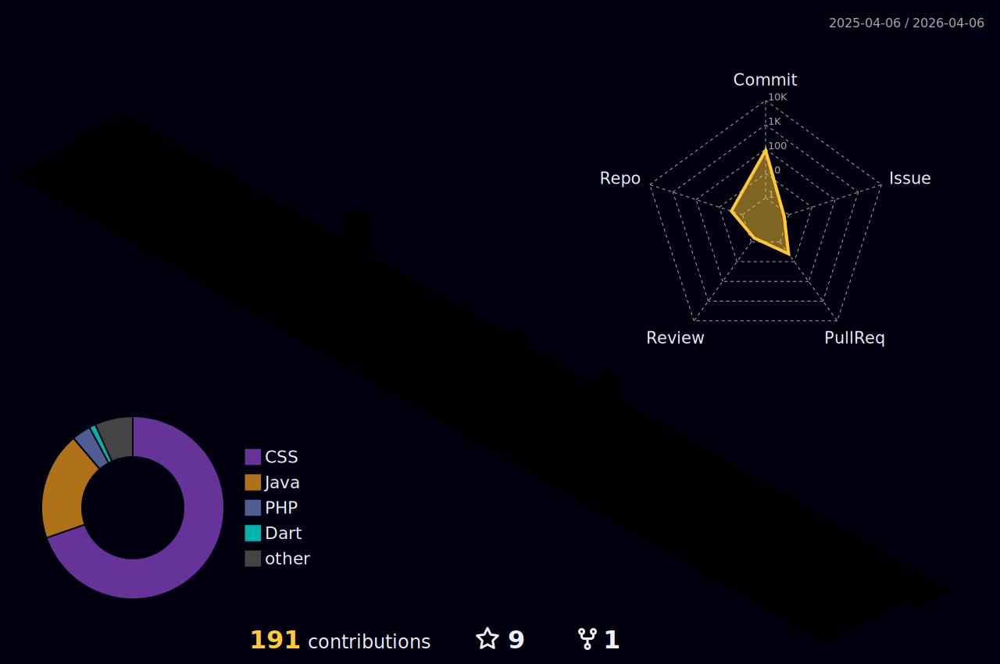

## Hi there 👋
### WELCOME TO MY GITHUB!🤓💻

### About me
### Bachelor in Systems and Digital Media from UFC Fortaleza | Requirement Analyst on DARM Labs | Mobile & Web Developer.
#### 🔭 I'm Wesley, a mobile and web developer focused on mobile development. I am currently honing my skills in Flutter with different applications. I also enjoy doing web development and graphic design projects.
##### ☕ Passionate about science fiction films and documentaries, eclectic in music and an avid reader.

### 💡 The profile picture is an image edited in Adobe Photoshop. 
    

 |  |  |
 | ----------- | ----------- |

 
  

   

  

 
##
   

     
  

  
  
 
    
    
    
    
    
    
    
    
    
    
    
    
    
    
    
    
    
    
    
    
    

    
  

  
   ##
 
  
  
